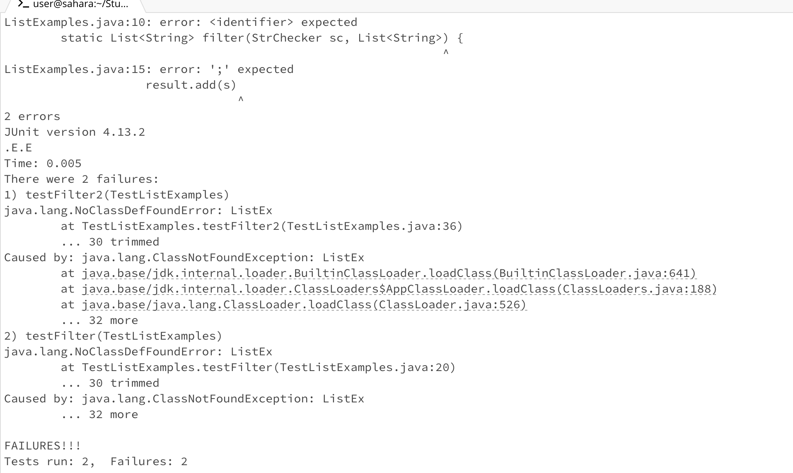

Part 1: Debugging Scenario
1. Student: Hi, I come across some problems when running the ListExamples. It says ```NoClassDefFoundError: ListEx``` but I checked that I have defined the ListEx in my ListExamples.java file. I think there might be something wrong with some of the arguments in the defination of the Filter?
   
2. David(TA): That's a good guess. You might try using debugger to find the bug!
   Try
   ```
   javac -g -cp .:lib/hamcrest-core-1.3.jar:lib/junit-4.13.2.jar *.java
   jdb -classpath .:lib/hamcrest-core-1.3.jar:lib/junit-4.13.2.jar org.junit.runner.JUnitCore TestListExamples
   ```
And see what will it say?
3. The terminal output:
```
ListExamples.java:10: error: <identifier> expected
        static List<String> filter(StrChecker sc, List<String>) {
                                                              ^
ListExamples.java:15: error: ';' expected
                    result.add(s)
                                 ^
2 errors
Initializing jdb ...
```
Student: Ohh I realize that the types for the arguments of filter in the wrong order at 10th line and also forget a ";" at the 15th line of ListExamples since the debugger points out the error on both lines.

1. Student: Hii, I have fixed the bugs above but after I recompiled and rerun the test, there's another error!


4.All the information needed about the setup:
1). The file & directory structure needed:
```
-Student
  -lib
    -hamcrest-core-1.3.jar
    -junit-4.13.2.jar
  -IsA.class
  -ListExamples.class
  -ListExamples.java
  -StrChecker.class
  -TestListExamples.class
  -TestListExamples.java
  -debug.sh
  -test.sh
```

2). The contents of each file before fixing the bug:
Content of ListExamples:
```
import java.util.Arrays;
import java.util.List;
import java.util.ArrayList;

interface StrChecker { boolean checkString(String s); }
    class ListEx {
        private static List<String> result = new ArrayList<>();
        // Returns a new list that has only the elements of the
        // input where the given StringChecker returns true
        static List<String> filter(StrChecker sc, List<string> list) {
            if(list.size() == 0) { return list; }
            result.clear();
            for(String s: list) {
                if(sc.checkString(s)) {
                    result.add(s)
                }
            }
            return result;
        }
}

```

Content of TestListExamples:
```
import static org.junit.Assert.*;
import org.junit.*;
import java.util.Arrays;
import java.util.List;

class IsA implements StrChecker {
    public boolean checkString(String s) {
        return s.equalsIgnoreCase("a");
    }
}

public class TestListExamples {
    @Test
    public void testFilter() {
        List<String> s1 = Arrays.asList("a", "b");
        List<String> s2 = Arrays.asList("d", "a");

        List<String> expect = Arrays.asList("a");

        List<String> result1 = ListEx.filter(s1, new IsA());
        List<String> result2 = ListEx.filter(s2, new IsA());

        assertEquals(expect, result1);
        assertEquals(expect, result2);

    }

    @Test
    public void testFilter2() {
        List<String> s1 = Arrays.asList("a", "b", "c", "d", "a");
        List<String> s2 = Arrays.asList("c", "a", "a", "a");

        List<String> expect1 = Arrays.asList("a", "a");
        List<String> expect2 = Arrays.asList("a", "a", "a");

        List<String> result1 = ListEx.filter(s1, new IsA());
        List<String> result2 = ListEx.filter(s2, new IsA());

        assertEquals(expect1, result1);
        assertEquals(expect2, result2);
    }
}
```
Content of test.sh:
```
javac -cp .:lib/hamcrest-core-1.3.jar:lib/junit-4.13.2.jar *.java
java -cp .:lib/hamcrest-core-1.3.jar:lib/junit-4.13.2.jar org.junit.runner.JUnitCore TestListExamples
```

3)
