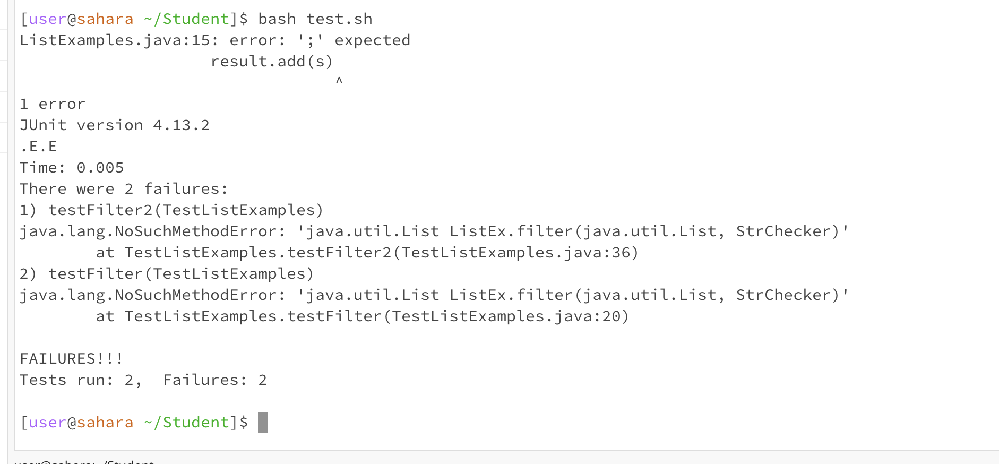

Part 1: Debugging Scenario
The first bug(s):
1. Student: Hi, I come across some problems when running the ListExamples. Besides the";" I forgot, it says ```java.lang.NoSuchMethodError: 'java.util.List ListEx.filter(java.util.List, StrChecker)'``` at both 20th and 36th line but I checked that I have defined the ListEx well in my ListExamples.java file. I think there might be something wrong with some of the arguments in the defination of the Filter?


2. David(TA): That's a good guess. You might try using debugger to find the bug!
   Try
   ```
   javac -g -cp .:lib/hamcrest-core-1.3.jar:lib/junit-4.13.2.jar *.java
   jdb -classpath .:lib/hamcrest-core-1.3.jar:lib/junit-4.13.2.jar org.junit.runner.JUnitCore TestListExamples
   ```
And see what will it say?(Or you can also put those commands into a "sh" file.The use ```stop``` ,```locals```... to help you find the bugs and fix them!
3. My jdb "sh" file:
```
javac -g -cp .:lib/hamcrest-core-1.3.jar:lib/junit-4.13.2.jar *.java
jdb -classpath .:lib/hamcrest-core-1.3.jar:lib/junit-4.13.2.jar org.junit.runner.JUnitCore TestListExamples

```
The terminal output:

```
bash debug.sh 
TestListExamples.java:20: error: incompatible types: List<String> cannot be converted to StrChecker
        List<String> result1 = ListEx.filter(s1, new IsA());
                                             ^
TestListExamples.java:21: error: incompatible types: List<String> cannot be converted to StrChecker
        List<String> result2 = ListEx.filter(s2, new IsA());
                                             ^
TestListExamples.java:36: error: incompatible types: List<String> cannot be converted to StrChecker
        List<String> result1 = ListEx.filter(s1, new IsA());
                                             ^
TestListExamples.java:37: error: incompatible types: List<String> cannot be converted to StrChecker
        List<String> result2 = ListEx.filter(s2, new IsA());
                                             ^
Note: Some messages have been simplified; recompile with -Xdiags:verbose to get full output
4 errors
Initializing jdb ...
```
```
stop at TestListExamples:20
Deferring breakpoint TestListExamples:20.
It will be set after the class is loaded.
> run
run org.junit.runner.JUnitCore TestListExamples
Set uncaught java.lang.Throwable
Set deferred uncaught java.lang.Throwable
> 
VM Started: JUnit version 4.13.2
Set deferred breakpoint TestListExamples:20
.E.
Breakpoint hit: "thread=main", TestListExamples.testFilter(), line=20 bci=49
20            List<String> result1 = ListEx.filter(s1, new IsA());

main[1] locals
Local variable information not available.  Compile with -g to generate variable information
main[1] print expect
com.sun.tools.example.debug.expr.ParseException: Name unknown: expect
 expect = null
```
Student: Ohh I realize that the types for the arguments of filter in the wrong order at 10th line and also forget a ";" at the 15th line of ListExamples since by using the debugger I found that there's no local variables even if I have compiled with -g to generate variable information and also I cannot print expect value even though I have defined it in the last step so that the only reason might be the defination of the ListFilter is wrong. All in all, I forget a ";" at the 15th line of ListExamples and the arguments of filter should be ```List<String> filter(List<String> list, StrChecker sc)```, I get wrong the order to ```List<String> filter(StrChecker sc, List<String> list)```.


The second bug(s):
1. Student: Hii, I have fixed the bugs above but after I recompiled and rerun the test, there's another error!
```
[user@sahara ~/Student]$ bash test.sh 
JUnit version 4.13.2
.E.
Time: 0.006
There was 1 failure:
1) testFilter2(TestListExamples)
java.lang.AssertionError: expected:<[a, a]> but was:<[a, a, a]>
at org.junit.Assert.fail(Assert.java:89)
at org.junit.Assert.failNotEquals(Assert.java:835)
at org.junit.Assert.assertEquals(Assert.java:120)
at org.junit.Assert.assertEquals(Assert.java:146)
at TestListExamples.testFilter2(TestListExamples.java:39)

FAILURES!!!
Tests run: 2,  Failures: 1
```
It says that ```expected:<[a, a]> but was:<[a, a, a]>```. I think the failure-induce input is 
```
 List<String> s1 = Arrays.asList("a", "b", "c", "d", "a");
List<String> s2 = Arrays.asList("c", "a", "a", "a");
```
Since in the 39th line the error happened, I guess the expect of s2 has some inpact on the expect of s1 thus they might be both```[a, a, a]>```.

2.David(TA): Good guess! Again, you might try using debugger to find the bug!
   Try
   ```
   javac -g -cp .:lib/hamcrest-core-1.3.jar:lib/junit-4.13.2.jar *.java
   jdb -classpath .:lib/hamcrest-core-1.3.jar:lib/junit-4.13.2.jar org.junit.runner.JUnitCore TestListExamples
   ```
And see what will it say?(Or you can also put those commands into a "sh" file.The use ```stop``` ,```locals```... to help you find the bugs and fix them!

3. The terminal output:
```
[user@sahara ~/Student]$ bash debug.sh 
Initializing jdb ...
> stop at TestListExamples:39
Deferring breakpoint TestListExamples:39.
It will be set after the class is loaded.
> run
run org.junit.runner.JUnitCore TestListExamples
Set uncaught java.lang.Throwable
Set deferred uncaught java.lang.Throwable
> 
VM Started: JUnit version 4.13.2
Set deferred breakpoint TestListExamples:39
.
Breakpoint hit: "thread=main", TestListExamples.testFilter2(), line=39 bci=129
39            assertEquals(expect1, result1);

```

```
main[1] locals
Method arguments:
Local variables:
s1 = instance of java.util.Arrays$ArrayList(id=1052)
s2 = instance of java.util.Arrays$ArrayList(id=1053)
expect1 = instance of java.util.Arrays$ArrayList(id=1054)
expect2 = instance of java.util.Arrays$ArrayList(id=1055)
result1 = instance of java.util.ArrayList(id=1056)
result2 = instance of java.util.ArrayList(id=1056)
main[1] print result1
 result1 = "[a, a, a]"
main[1] print result2
 result2 = "[a, a, a]"
main[1] print ListEx.result
 ListEx.result = "[a, a, a]"

```
This preliminarily proved my guess by showing that the result1 is the same as result 2, being ```[a, a, a]``` . The let's stop at two steps before it generates the result2.
```
[user@sahara ~/Student]$ bash debug.sh 
Initializing jdb ...
> stop at TestListExamples:37
Deferring breakpoint TestListExamples:37.
It will be set after the class is loaded.
> run
run org.junit.runner.JUnitCore TestListExamples
Set uncaught java.lang.Throwable
Set deferred uncaught java.lang.Throwable
> 
VM Started: JUnit version 4.13.2
Set deferred breakpoint TestListExamples:37
.
Breakpoint hit: "thread=main", TestListExamples.testFilter2(), line=37 bci=116
37            List<String> result2 = ListEx.filter(s2, new IsA());

main[1] locals
Method arguments:
Local variables:
s1 = instance of java.util.Arrays$ArrayList(id=1052)
s2 = instance of java.util.Arrays$ArrayList(id=1053)
expect1 = instance of java.util.Arrays$ArrayList(id=1054)
expect2 = instance of java.util.Arrays$ArrayList(id=1055)
result1 = instance of java.util.ArrayList(id=1056)
main[1] print result1
 result1 = "[a, a]"
```
The result1 is now ```"[a, a]"```!! So that my guess is correct, the value of result2 covers that of result1. After check on the code in ListExamples.java, I found that I should difine the``` List<String> result``` after the filter method so that each time I use that methond, I can always produce a new arraylist to store the value of result and there is no need to think of the case```list.size() == 0```.
After fixing that, my code is  
```
import java.util.Arrays;
import java.util.List;
import java.util.ArrayList;

interface StrChecker { boolean checkString(String s); }
    class ListEx {
        
        // Returns a new list that has only the elements of the
        // input where the given StringChecker returns true
        static List<String> filter(List<String> list, StrChecker sc) {
            List<String> result = new ArrayList<>();
            for(String s: list) {
                if(sc.checkString(s)) {
                    result.add(s);
                }
            }
            return result;
        }
}
```
for the ListExamples.java. And then the test passes finally!!!
```
[user@sahara ~/Student]$ bash test.sh 
JUnit version 4.13.2
..
Time: 0.005

OK (2 tests)
```

4.All the information needed about the setup:
1). The file & directory structure needed:
```
-Student
  -lib
    -hamcrest-core-1.3.jar
    -junit-4.13.2.jar
  -IsA.class
  -ListExamples.class
  -ListExamples.java
  -StrChecker.class
  -TestListExamples.class
  -TestListExamples.java
  -debug.sh
  -test.sh
```

2). The contents of each file before fixing the bug:
Content of ListExamples:
```
import java.util.Arrays;
import java.util.List;
import java.util.ArrayList;

interface StrChecker { boolean checkString(String s); }
    class ListEx {
        private static List<String> result = new ArrayList<>();
        // Returns a new list that has only the elements of the
        // input where the given StringChecker returns true
        static List<String> filter(StrChecker sc, List<String> list) {
            if(list.size() == 0) { return list; }
            result.clear();
            for(String s: list) {
                if(sc.checkString(s)) {
                    result.add(s)
                }
            }
            return result;
        }
}
```

Content of TestListExamples:
```
import static org.junit.Assert.*;
import org.junit.*;
import java.util.Arrays;
import java.util.List;

class IsA implements StrChecker {
    public boolean checkString(String s) {
        return s.equalsIgnoreCase("a");
    }
}

public class TestListExamples {
    @Test
    public void testFilter() {
        List<String> s1 = Arrays.asList("a", "b");
        List<String> s2 = Arrays.asList("d", "a");

        List<String> expect = Arrays.asList("a");

        List<String> result1 = ListEx.filter(s1, new IsA());
        List<String> result2 = ListEx.filter(s2, new IsA());

        assertEquals(expect, result1);
        assertEquals(expect, result2);

    }

    @Test
    public void testFilter2() {
        List<String> s1 = Arrays.asList("a", "b", "c", "d", "a");
        List<String> s2 = Arrays.asList("c", "a", "a", "a");

        List<String> expect1 = Arrays.asList("a", "a");
        List<String> expect2 = Arrays.asList("a", "a", "a");

        List<String> result1 = ListEx.filter(s1, new IsA());
        List<String> result2 = ListEx.filter(s2, new IsA());

        assertEquals(expect1, result1);
        assertEquals(expect2, result2);
    }
}
```
Content of test.sh:
```
javac -cp .:lib/hamcrest-core-1.3.jar:lib/junit-4.13.2.jar *.java
java -cp .:lib/hamcrest-core-1.3.jar:lib/junit-4.13.2.jar org.junit.runner.JUnitCore TestListExamples
```

3)The full command line (or lines) you ran to trigger the bug:
```
bash debug.sh
```
```
stop at TestListExamples:20
```
```
run
```
```
locals
```
```
print expect
```
```
exit
```
```
bash debug.sh
```
```
stop at TestListExamples:39
```
```
run
```
```
locals
```
```
print result1
```
```
print result2
```
```
print ListEx.result
```
```
exit
```
```
bash debug.sh
```
```
stop at TestListExamples:37
```
```
run
```
```
locals
```
```
print result1
```
```
exit
```
4). A description of what to edit to fix the bug:
As I have stated above: There are totally 3 bugs. I need to 1) Add ";" at the end of the 15th line; (2) the arguments of filter should be ```List<String> filter(List<String> list, StrChecker sc)```, I need to change to that from ```List<String> filter(StrChecker sc, List<String> list)```; (3)  I should difine the``` List<String> result``` after the filter method so that each time I use that methond, I can always produce a new arraylist to store the value of result and there is no need to think of the case```list.size() == 0```

Part 2: Reflection

During the second half of the quarter, I learned about the importance of code review and how it significantly improves code quality. Through the lab exercises on code review, I gained insights into best practices, such as providing constructive feedback, catching potential bugs, and enhancing code readability. Additionally, I explored the intricacies of using debuggers effectively, which proved to be an invaluable skill in identifying and resolving issues in my code. These experiences have not only enhanced my technical abilities but also highlighted the collaborative nature of software development. Also, the most interesting part I learnt is to use vim to do all of the things using command line!! which is the first time I have ever tried.
Last but not the least, as an exchange student not majoring in computer science, I got a lot of help from both my classmates and TAs, which is also an invaluable memory during the exchange. And thus I paid a lot of time and energy into this class, hope to get an A at last and explore some research opportunities in the UCSD!!


